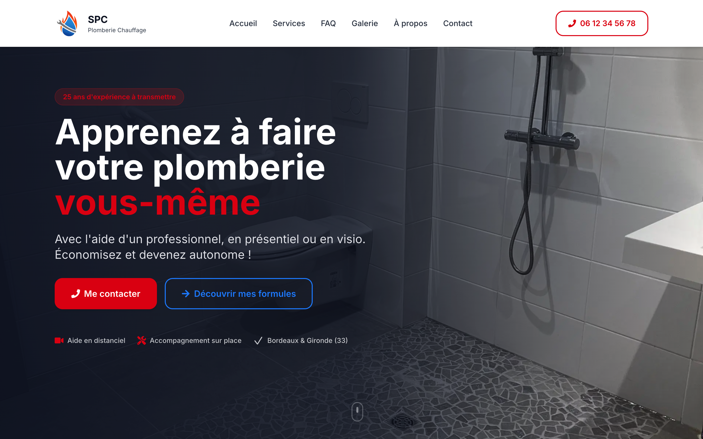
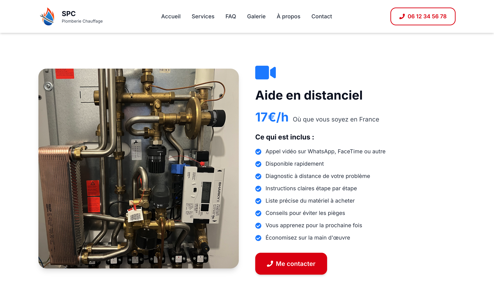
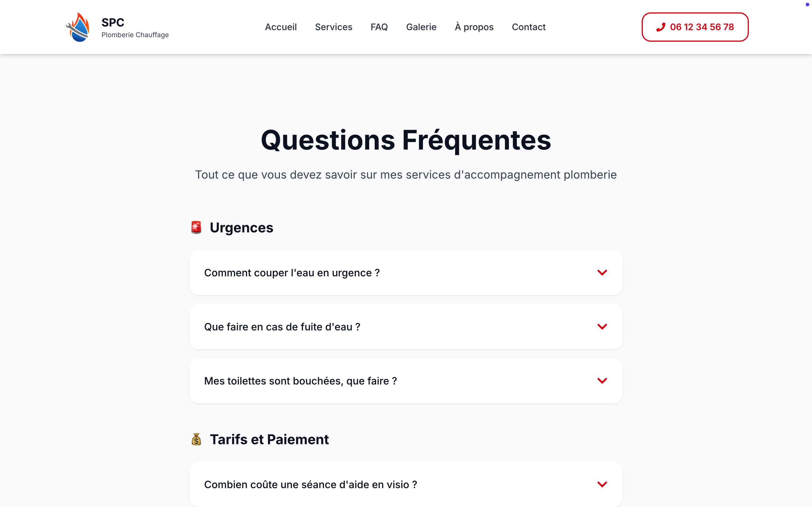
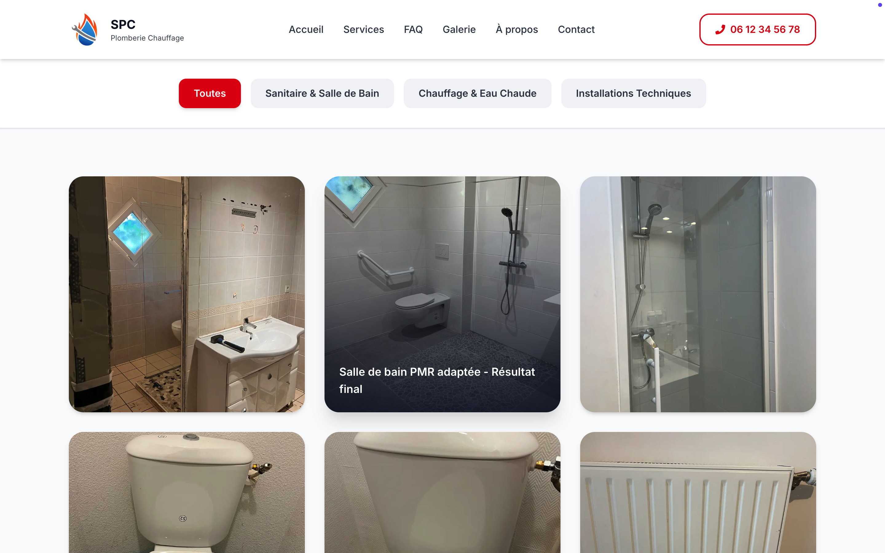
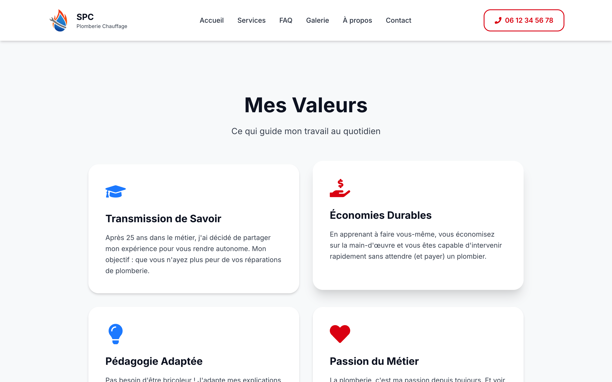
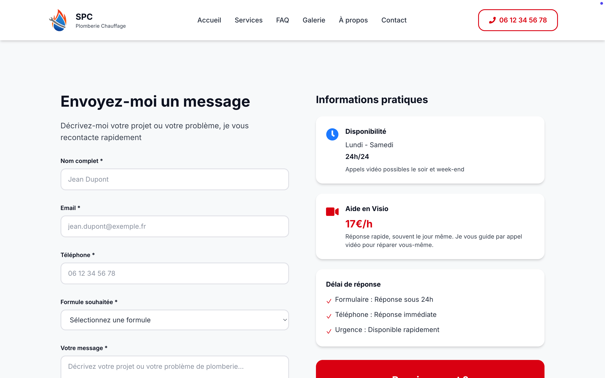

# Site vitrine — Plombier-chauffagiste

Projet réalisé par [Baverdie](https://baverdie.fr) pour un plombier-chauffagiste en Gironde. Site vitrine avec un concept différenciant : accompagnement pédagogique des particuliers pour qu'ils réalisent eux-mêmes leurs travaux — en visio ou sur place.

> Projet suspendu. Le site n'est plus en ligne.

---

## Le projet

Le site présentait trois formules d'accompagnement :

- **Aide en visio** — guidage par appel vidéo pour toute la France
- **Accompagnement sur place** — déplacement en Gironde (33)
- **Intervention complète** — prestation classique clé en main

---

## Aperçu

---

## Pages

| Page | Contenu |
| --- | --- |
| `/` | Homepage — hero, services, galerie, stats, à propos, CTA |
| `/services` | Détail des trois formules d'accompagnement |
| `/galerie` | Galerie de réalisations avec lightbox |
| `/faq` | Questions fréquentes en accordéon |
| `/a-propos` | Présentation du plombier |
| `/contact` | Formulaire de contact via EmailJS |
| `/mentions-legales` | Mentions légales |
| `/politique-cookies` | Politique de cookies |

---

## Stack technique

- **Next.js 15** (App Router)
- **React 19**
- **TypeScript**
- **Tailwind CSS**
- **Framer Motion** — animations et transitions
- **EmailJS** — envoi de formulaire sans backend
- **Vercel** — hébergement et déploiement

---

## Réalisé par

[Baverdie](https://baverdie.fr) — Développement web freelance.

---

© 2026 Baverdie — Tous droits réservés. Toute reproduction, même partielle, est interdite sans autorisation écrite.
